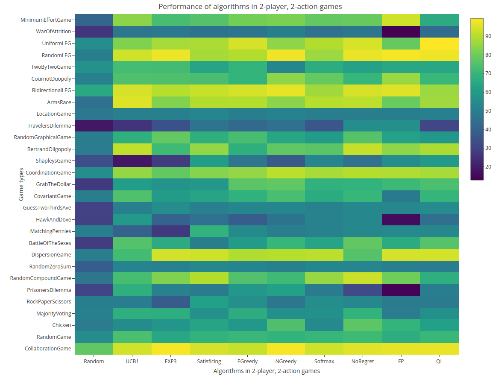
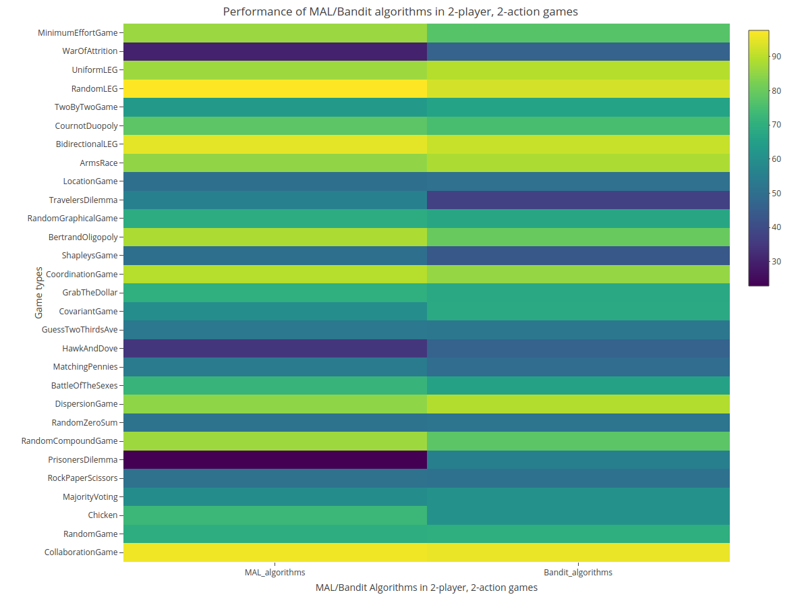
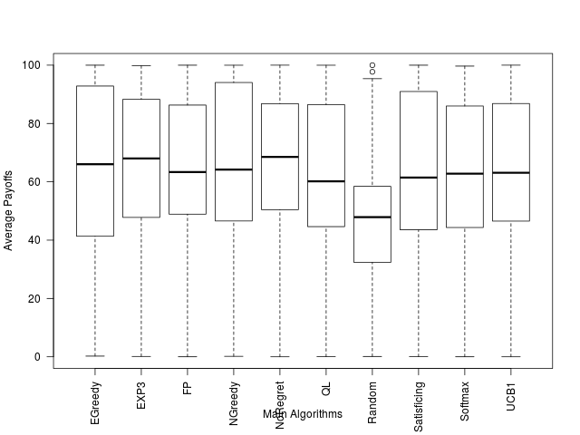
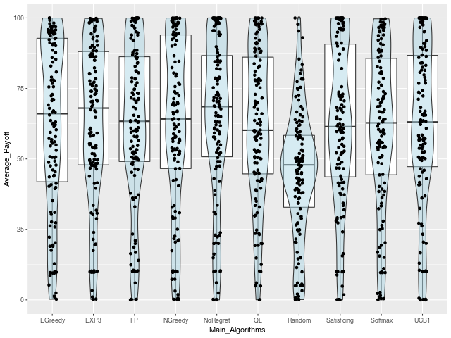

## Description 
The test bed for both multi-agent learning algorithms and bandit algorithms, which can be run with various game types. The basic framework includes three main components:

- Algorithm set: [(here)](#algorithms)
  - MAL: No-regret, Q-Learning, Fictious Play, (Markov)
  - Bandit: UCB1, EXP3, Satificing, E-greedy, N-greedy, Softmax
  - Others: Random
- Game Types [(here)](#gametypes)
	- Game types in GAMUT, the suite of game generator, e.g. Coordination, Prison Dilemma, Chicken etc
- Metrics:
	- Average Accumulated Rewards
	- Average Accumulated Regrets

## Features
- A complete test framework to evaluate correlation among algorithms, games, and metrics.
- Cover popular or representative MAL & Bandit algorithms that can be run in m-action n-player games.
- Use multi-threading to improve running time, which is suitable to run a large scale tournament.
- Single sqlite3 database file to store all experiment result.
- Integrated GoogleTest for unit tests. 
- Combined with statistical analysis and visualization in R scripts.

## Build Dependencies 
- Boost (command line input parsing)
- sqlite3 (database access)
- gtest (optionally used for unit testing.)

#### Build dependencies by make only
-  Install Boost and sqlite3 libraries
2. Modify library and header file paths of libraries in Makefile
3. `make -j8`

#### Build dependencies by Conan
-  `pip conan` (if not installed in the system)
2. `vim ~/.conan/profiles/default` (compiler.libcxx=libstdc++11) (if gcc version > 5.1)
3. `conan install .` (install all dep. and generate .mak)
4. `cp Makefiles/MakefileForConan .` (use Conan version Makefile)
5. `make -j8` 

### Build and run the program
- `make -j8 && ./mal`
- `make test -j8 && ./unittest` 

## Test environments 
- Ubuntu 16.04 LTS / gcc 8.1.0
- macOS Mojave 10.14 / clang- 1000.10.44.4

## How to use 
1. A 2-player 2-action Random Game with a algorithm pair (Softmax(6), FP(8)): `./mal -g RandomGame -a 2 -p 2 -s 6 -e 8`
2. Run a tournament w/ all algorithms in a 2-player game w/ 3000 iterations
`./mal -o true -r 3000`
3. Run a tournament w/ all algorithm pairs in all game types
`./mal -q true`
4. Run a tournament w/ all algorithm paris in 3-action 5-player games 
`./mal -q true -p 5 -a 3
5. Run a tournament w/ all algorithm pairs in m-action n-player games (Note: time consuming)
`./run_naction.sh`

## Command line flags 
- `./mal --help`  

| Flag  | Description | Default   |
| --- | --- | --- |
| -h [ --help ]                     | print usage message
| -g [ --gametype ] arg             | the game type for normal single game | (Default:RandomGame)
| -p [ --players ] arg              | the number of players in a game | (Default:2)
| -a [ --actions ] arg              | the number of actions for each player | (Default:2)
| -r [ --iterations ] arg               | the number of iterations in a game | (Default:10000)
| -s [ --strategy ] arg             | set main strategy in a single game for comparison (check available strategies)  | (Default:0)
| -e [ --opp_strategy ] arg         | set opponent strategy for comparison, in 2 player game (check available strategies) | (Default:1)
| -t [ --print_top ] arg            | print top n iterations info | (Default:3)
| -l [ --print_last ] arg           | print last n iterations info | (Default:1)
| -z [ --print_flag ] arg           | true to print more info.| (Default:true)
| -y [ --permute ] arg              | run permutation of payoffs. | (Default:false)
| -o [ --tournament ] arg           | run tournament w/ single game in all  algorithm pairs.| (Default:false)
| -q [ --tournament_all_games ] arg | run tournament w/ all game types and all algorithms. | (Default:false)
| -m [ --enable_multithreading ] arg | enable multithreading. | (Default:true)
| -v [ --total_stratagies ] arg     | total strategies for tournament mode. | (Default:10)

 
### Available strategies 
Random = 0 ; UCB1 = 1 ; EXP3 = 2 ; Satisficing = 3 ; EGreedy = 4 ; NGreedy = 5 ; Softmax = 6 ; NoRegret = 7 ; FP = 8 ; QL = 9 ; BrFP = 10 ; Markov = 11 ; 

- Note: BrFP & Markov are not available now

 
### Available game types 
1. Extentable players && extentable actions:
RandomGame, MajorityVoting, DispersionGame, GuessTwoThirdsAve, CovariantGame, BertrandOligopoly, BidirectionalLEG, TravelersDilemma, RandomGraphicalGame, RandomLEG, UniformLEG, MinimumEffortGame, 
2. Extentable actions:
RandomZeroSum, GrabTheDollar, LocationGame, ArmsRace, CournotDuopoly, WarOfAttrition, 
3. Extentable players:
CollaborationGame, RandomCompoundGame, CoordinationGame, 
4. No parameter needed:
Chicken, RockPaperScissors, PrisonersDilemma, BattleOfTheSexes, MatchingPennies, HawkAndDove, ShapleysGame, TwoByTwoGame, 

Total 29 types ( Note: category 1 is used for all n-player, m-action experiment) 

## Running time performance
- Testing condition
	- Hardware:  (Intel(R) Xeon(R) CPU E3-1231 v3 @3.4GHz , 8 cores
	- Total Game Instances: 5800 2-player 2 actions game instances w/  10000 iterations
- Result:
	- **16m19s** (debug mode, single thread)
	- **3m13s** (debug mode, multi-thread, change the working flow to two stage operation) (Refer to the *pull-request game-create-run-separation*)
	- **1m51s** (release mode, use compiler flag -O3 only) 
	- **1m06s** (use pre-generated games)
- Possible improvements:
	- using asynchronous threads for database I/O and game file creation to achieve non-blocking executions.  (Done)
	- using pre-generated game files. (Done)
	- algorithm execution in each iteration 
	- others

## Reference
- Easy Logging library [github](https://github.com/zuhd-org/easyloggingpp)
- Google test [github](https://github.com/google/googletest) 
- UCB1 algorithm implementation written in Python. [github](https://github.com/j2kun/ucb1) 
- EXP3 algorithm implementation written in Python. [github](https://github.com/j2kun/exp3)
- Q-Learning written in Matlab [link](https://www.mathworks.com/matlabcentral/fileexchange/67989-q-learning-example)
- GAMUT, the suite of game generators [website](http://gamut.stanford.edu/)
- Multi-agent learning course in Utrecht university. [course website](http://www.cs.uu.nl/docs/vakken/maa/current/index.html)

## Screenshots
<!-- 
 -->
<!-- Algorithm v.s. Algorithm in a single game type -->
<!--  -->
<!-- 
 -->

<!-- 
 -->
<!--  -->
<!-- 
 -->

<!-- 
 -->
<!-- all algorithms in box plot. -->
<!--  -->

<!-- 
 -->
<!-- 
 -->
<!-- all algorithms in bean plot. -->
<!--  -->

<!-- 
 -->

