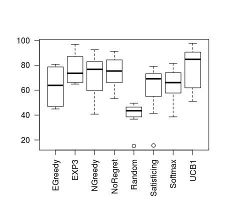

# mal-tournament
Build the test bed for multi-agent learning (MAL) and bandit algorithms w/ various game types
- Algorithm set:
  - MAL: No-regret, Q-Learning, Fictious Play, Markov
  - Bandit: UCB1, EXP3, Satificing, E-greedy, N-greedy, Softmax
  - Others: Random

# Dependencies (tweak Markfile after library installations)
- Boost (program_options)
- sqlite3 

# How to use 
- Run the tournament w/ all algorithms in 2-player game
```./mal -o true```

# Command line flags 
1. ```-r rounds``` / ```-p players``` /...
2. use ```./mal --help``` to query all available flags

# Reference
- Logging [github](https://github.com/zuhd-org/easyloggingpp)
- Google test [github](https://github.com/google/googletest)
- UCB1 [github](https://github.com/j2kun/ucb1) 
- EXP3 [github](https://github.com/j2kun/exp3)
- GAMUT, the suite of game generators [here](http://gamut.stanford.edu/)
- MAL course in UU [web](http://www.cs.uu.nl/docs/vakken/maa/current/index.html)


# Screen shot

box plot in R code

