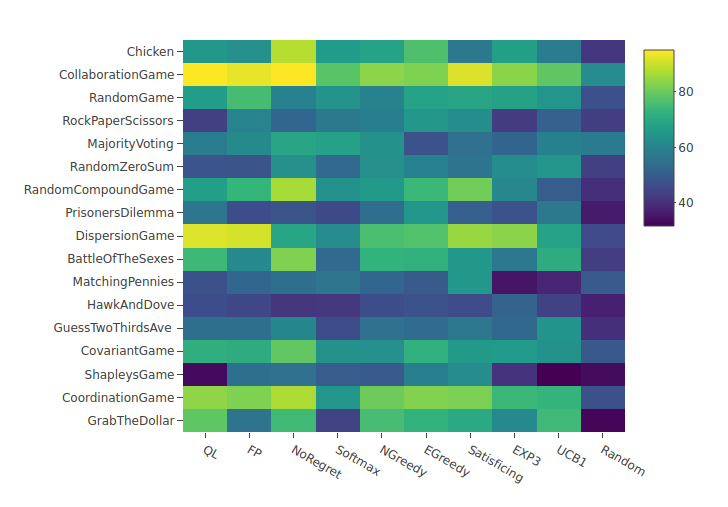

## mal-tournament
Build the test bed for both multi-agent learning algorithms and bandit algorithms, which can be adopted in various game types.

- Algorithm set: [(here)](#algorithms)
  - MAL: No-regret, Q-Learning, Fictious Play, (Markov)
  - Bandit: UCB1, EXP3, Satificing, E-greedy, N-greedy, Softmax
  - Others: Random
- Game Types [(here)](#gametypes)
	- Most of game types that Gamut (the suite of game generator) supports, e.g. Coordination, Prison Dilemma, Chicken etc
	- Custom defined game types 
- Metrics:
	- Accumulated Rewards
	- Accumulated Regrets

## Features
- A complete test framework to evaluate correlation among algorithms, games, and metrics.
- Cover popular MAL & Bandit algorithms as many as possible.
- Provide various game types from either scientific interested games or customized games.
- Multi-threading default enabled to improve experiment running time.
- Single sqlite3 database file to store all experiment result.
- system wide logging function.
- Integrated GoogleTest for unit tests. 
- Statistical analysis by visualization, such as heatmap, and boxchart.

## Build Dependencies 
- Boost (program_options)
- sqlite3 

Note: Tweak library pahts in Markfile after installation of libraries. 

### Simple build and test
- `make -j8 && ./mal`
- `make test -j8 && ./unittest` 

## Test OS
- Ubuntu 16.04 LTS
- macOS Mojave 10.14

## How to use 
1. RandomGame w/ 2 players 2 actions in Softmax v.s. FictitiousPlay algorithm: `./mal -g RandomGame -a 2 -p 2 -s 6 -e 8`
2. Run the tournament w/ all algorithms in a 2-player game w/ 3000 iterations
`./mal -o true -r 3000`
3. Run the tournament w/ all algorithm paris in all game types
`./mal -q true`

## Command line flags 
- `./mal --help`  

| Flag  | Description | Default   |
| --- | --- | --- |
| -h [ --help ]                     | print usage message
| -g [ --gametype ] arg             | the game type for normal single game | (Default:RandomGame)
| -p [ --players ] arg              | the number of players in a game | (Default:2)
| -a [ --actions ] arg              | the number of actions for each player | (Default:2)
| -r [ --rounds ] arg               | the number of rounds in a game | (Default:10000)
| -s [ --strategy ] arg             | set main strategy in a single game for comparison (check available strategies)  | (Default:0)
| -e [ --opp_strategy ] arg         | set opponent strategy for comparison, in 2 player game (check available strategies) | (Default:1)
| -t [ --print_top ] arg            | print top n rounds info | (Default:3)
| -l [ --print_last ] arg           | print last n rounds info | (Default:1)
| -z [ --print_flag ] arg           | true to print more info.| (Default:true)
| -y [ --permute ] arg              | run permutation of payoffs. | (Default:false)
| -o [ --tournament ] arg           | run tournament w/ single game in all  algorithm pairs.| (Default:false)
| -q [ --tournament_all_games ] arg | run tournament w/ all game types and all algorithms. | (Default:false)

 
### Available strategies 
Random = 0 ; UCB1 = 1 ; EXP3 = 2 ; Satisficing = 3 ; EGreedy = 4 ; NGreedy = 5 ; Softmax = 6 ; NoRegret = 7 ; FP = 8 ; QL = 9 ; BrFP = 10 ; Markov = 11 ; 

- Note: BrFP & Markov are not available now

 
### Available game types 
1. Extentable players && extentable actions:
RandomGame, MajorityVoting, DispersionGame, GuessTwoThirdsAve, CovariantGame, 
2. Extentable actions:
RandomZeroSum, GrabTheDollar, 
3. Extentable players:
CollaborationGame, RandomCompoundGame, CoordinationGame, 
4. No parameter needed:
Chicken, RockPaperScissors, PrisonersDilemma, BattleOfTheSexes, MatchingPennies, HawkAndDove, ShapleysGame, 

## Reference
- Easy Logging library [github](https://github.com/zuhd-org/easyloggingpp)
- Google test [github](https://github.com/google/googletest) 
- UCB1 algorithm implementation written in Python. [github](https://github.com/j2kun/ucb1) 
- EXP3 algorithm implementation written in Python. [github](https://github.com/j2kun/exp3)
- GAMUT, the suite of game generators [website](http://gamut.stanford.edu/)
- Multi-agent learning course in Utrecht university. [course website](http://www.cs.uu.nl/docs/vakken/maa/current/index.html)

## Screenshots

Algorithm v.s. Algorithm in a single game type

Algirhtm v.s. Algorithm in all game types

